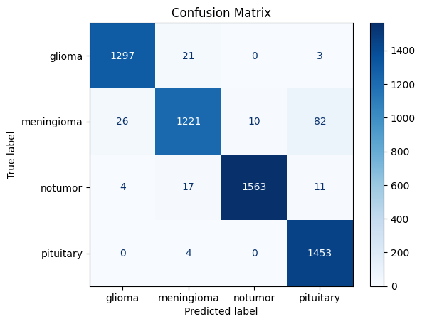

## Project overview ##

This project classifies brain MRI scans into three categories of brain tumors: **glioma**, **meningioma**, **notumor** and **pituitary tumors** using a Convolutional Neural Network (CNN).Brain tumor classification is critical for early diagnosis and treatment.It provides scripts for training the model on labeled data and for making predictions on new images.

## Dataset ##

The dataset contains brain MRI scans labeled as  **glioma**, **meningioma**,**notumor** and **pituitary tumors**.Download the dataset for custom training and testing.

Dataset link : https://www.kaggle.com/datasets/masoudnickparvar/brain-tumor-mri-dataset

## Installation ##

Follow these steps to set up the Brain Tumor Classification project on your local machine.

**Prerequisites:**

Before you begin, make sure you have the following installed on your system:

Python 3.7+
Git
Virtual Environment (optional but recommended)
pip (Python package installer)
Jupyter Notebook or colab
VScode

### 1. Clone the Repository: ###

git clone https://github.com/your-username/brain-tumor-classification.git
cd brain-tumor-classification

### 2. Install Required Dependencies: ###

The project dependencies are listed in the requirements.txt file. To install them, run:

pip install -r requirements.txt

### 4. Running the Model for Predictions ###

You can use the provided app.py script to classify a brain MRI image. The script loads the trained model and predicts the tumor type.

### Important Note ###: 
Ensure the versions are compatible, especially for TensorFlow,protobuf and streamlit, as version mismatches can lead to errors.

## Model Architecture
The CNN model used in this project follows a standard architecture:

**Input Layer**: Takes in MRI images.
**Convolutional Layers**: Three sets of Conv2D layers with increasing filters (64,128,256), followed by MaxPooling2D layers.
**Batch normalization**:Batch Normalization is a powerful technique to improve the training of deep neural networks. It normalizes the inputs of each layer to stabilize and accelerate the training process.
**L2 regularization**:L2 regularization is a powerful technique to improve the generalization of deep learning models by adding a penalty term to the loss function and reduce overfitting.
**Dropout Layer**: Reduces overfitting by randomly setting inputs to zero.
**Flatten Layer**: Converts the 2D matrix into a 1D vector.
**Dense Layers**: Three fully connected layers for learning complex features.
**Output Layer**: A softmax layer for multiclass classification.

## Model performance and evaluation

The model achieved an accuracy of 96.88% on the test set, demonstrating its effectiveness in classifying brain MRI scans.

     

